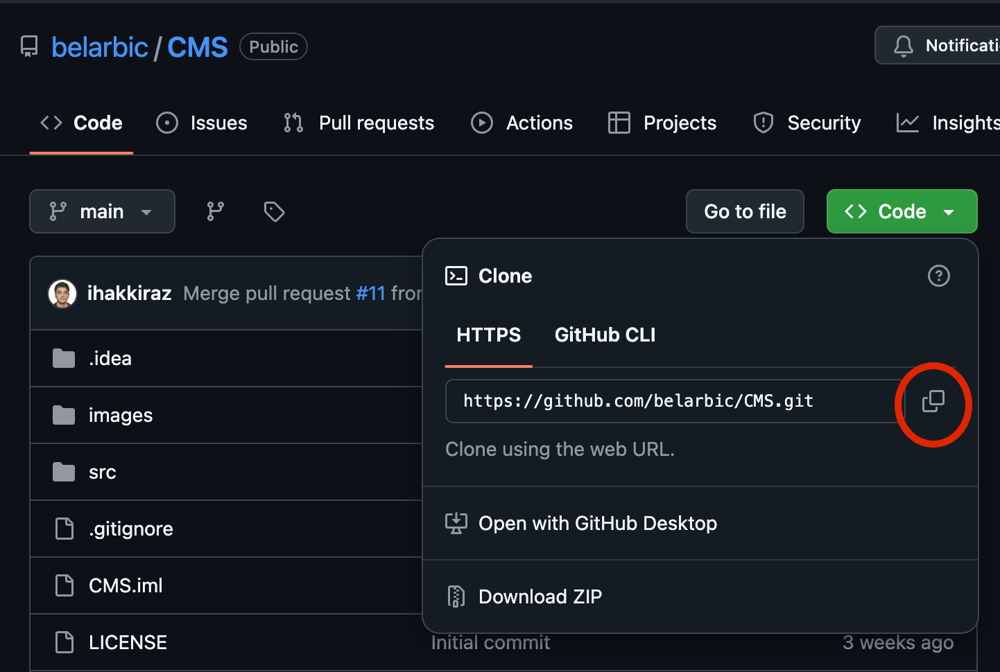
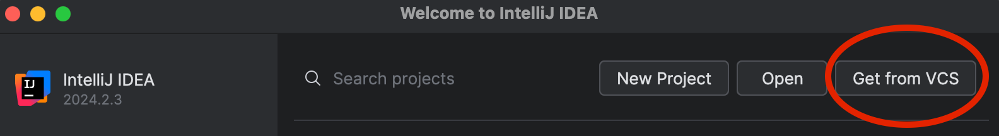
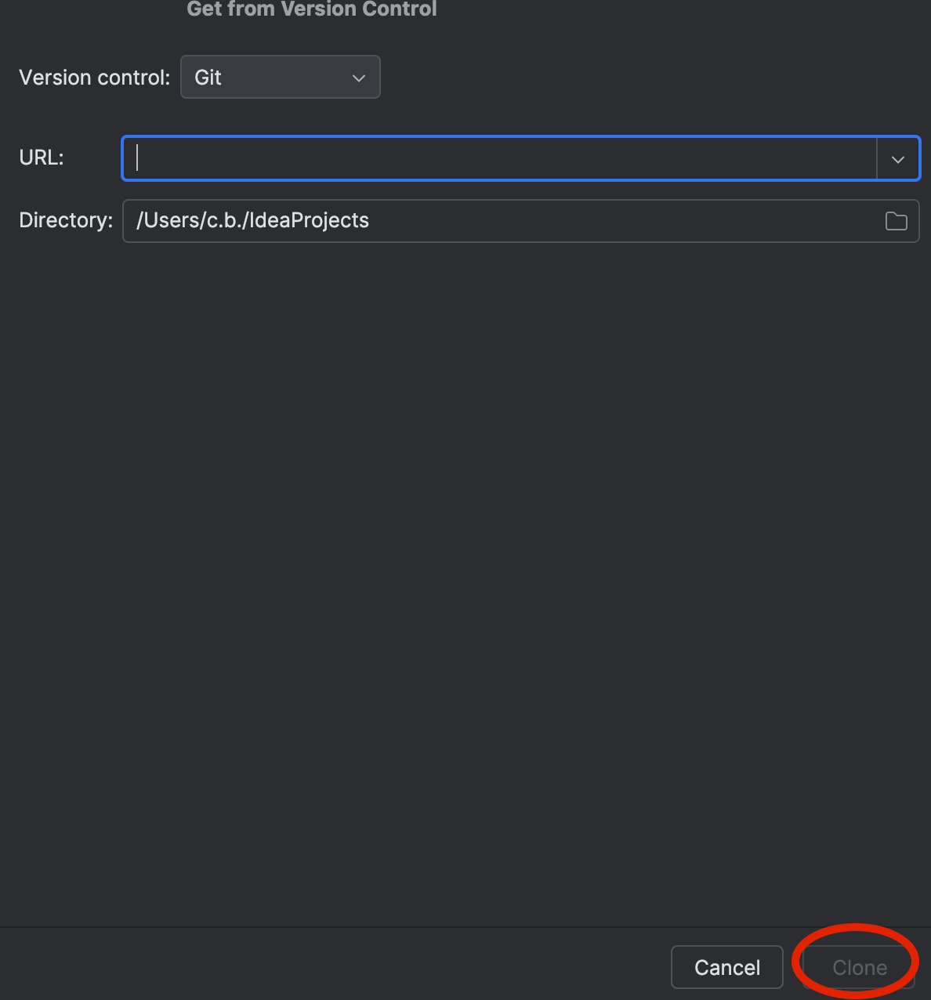

# Chat Messaging System (CMS)

The Chat Messaging System (CMS) is an application made for our CSC207 project. 
Users can chat with one another in chatrooms.
It allows users to create chatrooms, add participants and send/edit/delete messages in chatrooms.
This is a great program for users to be able to communicate with friends virtually when not with them in person.

**Contributors include:** Ali Gill, Chiraz Belarbi, Ismail Iraz and Joojo Botchway.

## Table of Contents
- [Features](#features)
- [Installation Instructions](#installation-instructions)
- [Usage Guide ](#usage-guide)
- [Feedback ](#feedback)
- [Contributions ](#contributions)
- [License](#license)

## Features

To access most of the following features, 
When you run the app, log in or sign up, until you are on the logged in screen below
[IMAGE]

***

### Create a Chatroom
This feature allows the user to create chatrooms and add other participants.

From the logged in view, click on the create chatroom button, which will lead you to the screen below.
Choose a name for your chatroom, add participants and you can add an optional first message! Then click create.
[IMAGE]

***

### View Chatrooms
This feature allows the user to see the chatrooms they are a part of and to join a chatroom.

From the logged in view, click on the view chatrooms button, which will lead you to the screen below.
[IMAGE]
Here, you can see all the chatrooms you are a part of and can click on any of them to join them.

***

## Installation Instructions

Go to the [github project](https://github.com/belarbic/CMS) and click on <> Code in green as seen below.
Click on the copy icon circled red, to copy the link to the repository.

***

When you open IntelliJ, click on 'Get From VCS' on the top right

***

Then enter the URL where needed and at the bottom right click clone.

***

Now you have the program downloaded!

#### Notes:
- Make sure to have the latest version of IntelliJ
- Use openjdk-22 version of Java

***

## Usage Guide

Once the application is installed and running, follow the steps below to start using the system.

### To Sign Up:
1. Click on the **Sign Up** button.
2. Enter a valid **username**, **password**, and **email**.
3. Click **Submit** to register your account.

### To Send a Message:
1. Log in with your credentials.
2. Navigate to an existing chat room or create a new one.
3. Type your message in the input field and press **Send**.

## Feedback

We welcome feedback to improve this project! Please submit your feedback via:

- **Google Forms:** [Submit Feedback Here](https://forms.gle/ERkbM7CtuZeFJwec7)

Please note valid feedback counts as stating a possible feature that can be implemented and explaining
said feature in enough detail to implement it.

When submitting your feedback, if it gets implemented, an email will be sent to you to add you as a contributor
to the project and to further get feedback on the implementation.

## Contributions

Please note contributions are closed at the moment.

## License

Creative Commons Legal Code

CC0 1.0 Universal

    CREATIVE COMMONS CORPORATION IS NOT A LAW FIRM AND DOES NOT PROVIDE
    LEGAL SERVICES. DISTRIBUTION OF THIS DOCUMENT DOES NOT CREATE AN
    ATTORNEY-CLIENT RELATIONSHIP. CREATIVE COMMONS PROVIDES THIS
    INFORMATION ON AN "AS-IS" BASIS. CREATIVE COMMONS MAKES NO WARRANTIES
    REGARDING THE USE OF THIS DOCUMENT OR THE INFORMATION OR WORKS
    PROVIDED HEREUNDER, AND DISCLAIMS LIABILITY FOR DAMAGES RESULTING FROM
    THE USE OF THIS DOCUMENT OR THE INFORMATION OR WORKS PROVIDED
    HEREUNDER.

Statement of Purpose

The laws of most jurisdictions throughout the world automatically confer
exclusive Copyright and Related Rights (defined below) upon the creator
and subsequent owner(s) (each and all, an "owner") of an original work of
authorship and/or a database (each, a "Work").

Certain owners wish to permanently relinquish those rights to a Work for
the purpose of contributing to a commons of creative, cultural and
scientific works ("Commons") that the public can reliably and without fear
of later claims of infringement build upon, modify, incorporate in other
works, reuse and redistribute as freely as possible in any form whatsoever
and for any purposes, including without limitation commercial purposes.
These owners may contribute to the Commons to promote the ideal of a free
culture and the further production of creative, cultural and scientific
works, or to gain reputation or greater distribution for their Work in
part through the use and efforts of others.

For these and/or other purposes and motivations, and without any
expectation of additional consideration or compensation, the person
associating CC0 with a Work (the "Affirmer"), to the extent that he or she
is an owner of Copyright and Related Rights in the Work, voluntarily
elects to apply CC0 to the Work and publicly distribute the Work under its
terms, with knowledge of his or her Copyright and Related Rights in the
Work and the meaning and intended legal effect of CC0 on those rights.

1. Copyright and Related Rights. A Work made available under CC0 may be
   protected by copyright and related or neighboring rights ("Copyright and
   Related Rights"). Copyright and Related Rights include, but are not
   limited to, the following:

i. the right to reproduce, adapt, distribute, perform, display,
communicate, and translate a Work;
ii. moral rights retained by the original author(s) and/or performer(s);
iii. publicity and privacy rights pertaining to a person's image or
likeness depicted in a Work;
iv. rights protecting against unfair competition in regards to a Work,
subject to the limitations in paragraph 4(a), below;
v. rights protecting the extraction, dissemination, use and reuse of data
in a Work;
vi. database rights (such as those arising under Directive 96/9/EC of the
European Parliament and of the Council of 11 March 1996 on the legal
protection of databases, and under any national implementation
thereof, including any amended or successor version of such
directive); and
vii. other similar, equivalent or corresponding rights throughout the
world based on applicable law or treaty, and any national
implementations thereof.

2. Waiver. To the greatest extent permitted by, but not in contravention
   of, applicable law, Affirmer hereby overtly, fully, permanently,
   irrevocably and unconditionally waives, abandons, and surrenders all of
   Affirmer's Copyright and Related Rights and associated claims and causes
   of action, whether now known or unknown (including existing as well as
   future claims and causes of action), in the Work (i) in all territories
   worldwide, (ii) for the maximum duration provided by applicable law or
   treaty (including future time extensions), (iii) in any current or future
   medium and for any number of copies, and (iv) for any purpose whatsoever,
   including without limitation commercial, advertising or promotional
   purposes (the "Waiver"). Affirmer makes the Waiver for the benefit of each
   member of the public at large and to the detriment of Affirmer's heirs and
   successors, fully intending that such Waiver shall not be subject to
   revocation, rescission, cancellation, termination, or any other legal or
   equitable action to disrupt the quiet enjoyment of the Work by the public
   as contemplated by Affirmer's express Statement of Purpose.

3. Public License Fallback. Should any part of the Waiver for any reason
   be judged legally invalid or ineffective under applicable law, then the
   Waiver shall be preserved to the maximum extent permitted taking into
   account Affirmer's express Statement of Purpose. In addition, to the
   extent the Waiver is so judged Affirmer hereby grants to each affected
   person a royalty-free, non transferable, non sublicensable, non exclusive,
   irrevocable and unconditional license to exercise Affirmer's Copyright and
   Related Rights in the Work (i) in all territories worldwide, (ii) for the
   maximum duration provided by applicable law or treaty (including future
   time extensions), (iii) in any current or future medium and for any number
   of copies, and (iv) for any purpose whatsoever, including without
   limitation commercial, advertising or promotional purposes (the
   "License"). The License shall be deemed effective as of the date CC0 was
   applied by Affirmer to the Work. Should any part of the License for any
   reason be judged legally invalid or ineffective under applicable law, such
   partial invalidity or ineffectiveness shall not invalidate the remainder
   of the License, and in such case Affirmer hereby affirms that he or she
   will not (i) exercise any of his or her remaining Copyright and Related
   Rights in the Work or (ii) assert any associated claims and causes of
   action with respect to the Work, in either case contrary to Affirmer's
   express Statement of Purpose.

4. Limitations and Disclaimers.

a. No trademark or patent rights held by Affirmer are waived, abandoned,
surrendered, licensed or otherwise affected by this document.
b. Affirmer offers the Work as-is and makes no representations or
warranties of any kind concerning the Work, express, implied,
statutory or otherwise, including without limitation warranties of
title, merchantability, fitness for a particular purpose, non
infringement, or the absence of latent or other defects, accuracy, or
the present or absence of errors, whether or not discoverable, all to
the greatest extent permissible under applicable law.
c. Affirmer disclaims responsibility for clearing rights of other persons
that may apply to the Work or any use thereof, including without
limitation any person's Copyright and Related Rights in the Work.
Further, Affirmer disclaims responsibility for obtaining any necessary
consents, permissions or other rights required for any use of the
Work.
d. Affirmer understands and acknowledges that Creative Commons is not a
party to this document and has no duty or obligation with respect to
this CC0 or use of the Work.